# stavby-rag

Ask the CTU construction textbook *Příprava a realizace staveb a objektů* a question, in Czech or
English, get a cited answer. One laptop, terminal or browser.

```
$ stavby ask "Jaké jsou stupně rozestavěnosti?"
Stupně rozestavěnosti jsou ... [1][3] ...

[1] 4.1 Stupně rozestavěnosti (ch. 4, cs) https://technologie.fsv.cvut.cz/aitom/podklady/online-priprava/kap4/text41.html
```

Hybrid retrieval (Qwen3-Embedding-8B + BM25, fused), Qwen3-Reranker-8B, answers from Claude or
local qwen3:14b, all through Ollama. PDF books can be indexed as extra corpora.
Why these models, eval numbers, site quirks: [docs/DESIGN.md](docs/DESIGN.md) · plain-language
tour: [docs/OVERVIEW.md](docs/OVERVIEW.md) · diagram: [docs/architecture.mmd](docs/architecture.mmd).

## How it works

**Offline, once.** A scoped crawler mirrors the four editions of the windows-1250 frameset site
(scanned PDFs go through Apple Vision OCR instead); text is cut into ~1400-char chunks with
breadcrumb headers; a dense index (4096-d embeddings) and a BM25 index (diacritics-folded,
prefix-stemmed) are built on disk.

**Online, per question.** Dense + BM25 retrieve 40 candidates each → RRF → the reranker scores
the top 12 (P(yes) from token logprobs) → second RRF → top 10 passages in the prompt (bodies
trimmed to 1000 chars) + conversation history → streamed answer with `[n]` citations.

```mermaid
flowchart LR
    subgraph OFF["Offline: build the index (once) — stavby crawl | ingest | index"]
        direction LR
        site["Textbook site<br/>technologie.fsv.cvut.cz<br/>4 editions · windows-1250 HTML"]
        pdf["PDF books<br/>scanned / broken text layer"]
        crawler["Crawler<br/>scoped BFS + extractor"]
        pdfbook["PdfBook<br/>PyMuPDF + Apple Vision OCR"]
        pages[/"data/pages.jsonl<br/>Page records: url, lang, edition,<br/>chapter, section, title, text"/]
        chunker["Chunker<br/>~1400 chars, 200 overlap<br/>breadcrumb prefix"]
        embed["Qwen3-Embedding-8B Q8_0<br/>via Ollama · 4096-d"]
        bm25["BM25 (bm25s)<br/>diacritics-folded + prefix stem"]
        subgraph IDX["data/index/"]
            direction TB
            f_chunks["chunks.jsonl"]
            f_dense["dense.npy<br/>N × 4096 float32"]
            f_bm25["bm25/"]
            f_meta["meta.json<br/>embed backend + model"]
        end
        site -- HTML --> crawler -- Page records --> pages
        pdf --> pdfbook -- same Page records --> pages
        pages --> chunker
        chunker -- "Chunk[]" --> embed --> f_dense
        chunker -- "Chunk[]" --> bm25 --> f_bm25
        chunker -.-> f_chunks
        embed -.-> f_meta
    end

    subgraph ON["Online: answer a question — stavby ask | chat | serve"]
        direction LR
        question["Question<br/>CLI stavby ask / chat<br/>or Telegram-style Web UI / REST API"]
        engine["Engine<br/>index loaded once in memory<br/>models kept warm (keep_alive=-1)<br/>hits + answers LRU"]
        lang["lang detect + mask<br/>cs / en · edition full | demo"]
        hybrid["dense top-40 ∪ BM25 top-40"]
        rrf1(("RRF"))
        reranker["Qwen3-Reranker-8B Q8_0<br/>P(yes) via Ollama logprobs<br/>top 12 candidates"]
        rrf2(("RRF<br/>rerank + retrieval"))
        top10[/"top-10 passages<br/>neighbour de-dup"/]
        prompt["prompt<br/>system rules + numbered sources<br/>bodies ≤ 1000 chars, no URLs<br/>+ conversation history"]
        llm["LLM<br/>Claude claude-opus-5 (Anthropic API)<br/>or local qwen3:14b (Ollama)"]
        answer["streamed answer<br/>[n] citations + source links<br/>back to the textbook pages"]
        question --> engine --> lang -- mask --> hybrid --> rrf1 -- top 12 --> reranker --> rrf2
        rrf1 -. retrieval order .-> rrf2
        rrf2 --> top10 --> prompt --> llm -- tokens stream --> answer
    end

    IDX -. loaded once at start .-> engine

    note1["everything runs on one laptop (24 GB Mac)"]
    note2["~1.4k chunks: brute-force cosine beats a vector DB here"]
    note3["measured: num_batch / NUM_PARALLEL / parallel<br/>workers = no gain · prefill 137 tok/s,<br/>gen 12 tok/s = bandwidth ceiling"]
    note4["speed levers: rerank pool 12 (34→21 s),<br/>prompt source trim 1000 chars (−7 s),<br/>llama.cpp prefix cache (repeat = 0.1 s)"]
    note2 -.- IDX
    note3 -.- reranker
    note4 -.- engine

    classDef proc fill:#DAE8FC,stroke:#4D4D4D,color:#333;
    classDef data fill:#FFF2CC,stroke:#4D4D4D,color:#333;
    classDef io fill:#F5F5F5,stroke:#4D4D4D,color:#333;
    classDef note fill:#FFF2CC,stroke:#4D4D4D,stroke-dasharray:4 3,color:#333;
    class crawler,pdfbook,chunker,embed,bm25,engine,lang,hybrid,rrf1,reranker,rrf2,llm proc;
    class pages,f_chunks,f_dense,f_bm25,f_meta,top10,prompt data;
    class site,pdf,question,answer io;
    class note1,note2,note3,note4 note;
```



## Install

macOS or Linux, one line (installs uv + Ollama if missing, pulls ~26 GB of models, crawls and
indexes the textbook, ~25 min on Apple silicon):

```bash
curl -fsSL https://raw.githubusercontent.com/korotole/mmu/main/install.sh | bash -s -- --with-index
```

From a checkout: `./install.sh --with-index`. Flags: `--claude` (store an Anthropic key),
`--no-models`, `--tune-ollama` (macOS memory tuning). Or package only:
`uv tool install "stavby-rag[web]"` (extras: `st` torch backend, `ocr` macOS Vision, `all`).

Data in `~/.stavby/data` (`data/` in a checkout, `STAVBY_HOME` to move). Config: env vars or
`.env` — see [.env.example](.env.example). Development: `uv sync --all-extras`, `uv run pytest -q`.

## Use

```bash
stavby crawl && stavby index               # once; ~25 min on an M4 Pro
stavby ask "Co je stavebně technologická studie?"
stavby ask "What does a site layout plan contain?" --backend anthropic --json
stavby chat                                # multi-turn, models stay resident
stavby search "harmonogram výstavby" --text   # retrieval only
stavby serve                               # web UI + API on http://127.0.0.1:8000
```

`stavby serve` starts `ollama serve` if it is not running and exits with the exact fix if the
index is missing — after the install one-liner it is the whole startup. PDF books:
`stavby ingest book.pdf --corpus mybooks && stavby index --corpus mybooks`.

API: `GET /api/health`, `GET /api/corpora`, `POST /api/ask` (`{question, corpus?, lang?, k?,
history?, stream?}`), `POST /api/ask/stream` (SSE: `meta`, `sources`, `token`…, `done`),
`GET /api/search?q=`, `POST /api/cache/clear`. `STAVBY_API_TOKEN` requires `Authorization: Bearer …`.

```bash
curl -s localhost:8000/api/ask -H 'content-type: application/json' \
  -d '{"question":"Co je kritická cesta?"}' | jq .answer
```

## Performance

The models are the cost: embedder 8 GB + reranker 8.7 GB + local LLM 9.3 GB — a 24 GB Mac cannot
hold all three, and Ollama reloads a model in 4–5 s. The code keeps the index in memory, pins
models with `keep_alive=-1`, serialises all Ollama traffic (parallel requests just make models
evict each other), memoises embeddings/hits/answers, and trims contexts to 2k tokens.
`./install.sh --tune-ollama` adds flash attention + 8-bit KV cache. Prefer Claude for answers
(`ANTHROPIC_API_KEY`): then only the two retrieval models stay resident.

Measured on an M4 Pro 24 GB (`uv run python scripts/bench.py`):

| step | cold (model reload) | warm | repeated |
|---|---|---|---|
| load index (1 401 chunks) | 0.03 s | – | – |
| embed query | 5.8 s | 0.1 s | 0 s |
| rerank 12 passages | 27 s | 21 s | 0 s |
| answer, Claude | + ~10–20 s | | 0 s |
| answer, qwen3:14b, thinking on | + 6 s load + 30–90 s | | 0 s |

Measured and rejected: `OLLAMA_NUM_PARALLEL=4`, `num_batch=2048`, q8_0 KV cache for co-residence
(limit is free system RAM, not GPU budget). Details in [docs/DESIGN.md](docs/DESIGN.md).

## Layout

```
src/stavby_rag/
  config.py    paths ($STAVBY_HOME, .env), crawl scope, model ids, Ollama knobs
  crawl.py     scoped crawler for the cp1250 frameset site -> Page records
  pdf.py       PDF books -> Page records (PyMuPDF, Apple Vision OCR)
  chunk.py     paragraph-aware windows with breadcrumbs
  embed.py     Ollama / sentence-transformers embedders, Qwen3 reranker via logprobs
  store.py     on-disk index: chunks.jsonl, dense.npy, bm25/, meta.json
  retrieve.py  dense ∪ BM25 -> RRF -> rerank -> RRF -> top-k
  llm.py       prompt + Anthropic / Ollama streaming backends
  engine.py    process-wide pipeline: index once, warm models, caches, lock
  server.py    FastAPI app (+ static/index.html chat UI)
  cli.py       typer CLI
tests/         pipeline + server tests, no model weights needed
eval/          48 questions with expected chapter/section for `stavby eval`
scripts/       bench.py
docs/          DESIGN.md, OVERVIEW.md, architecture.drawio / .mmd
```

MIT licence.
